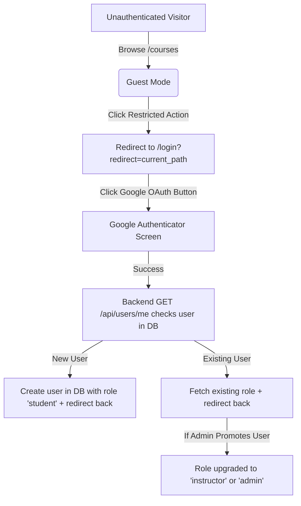
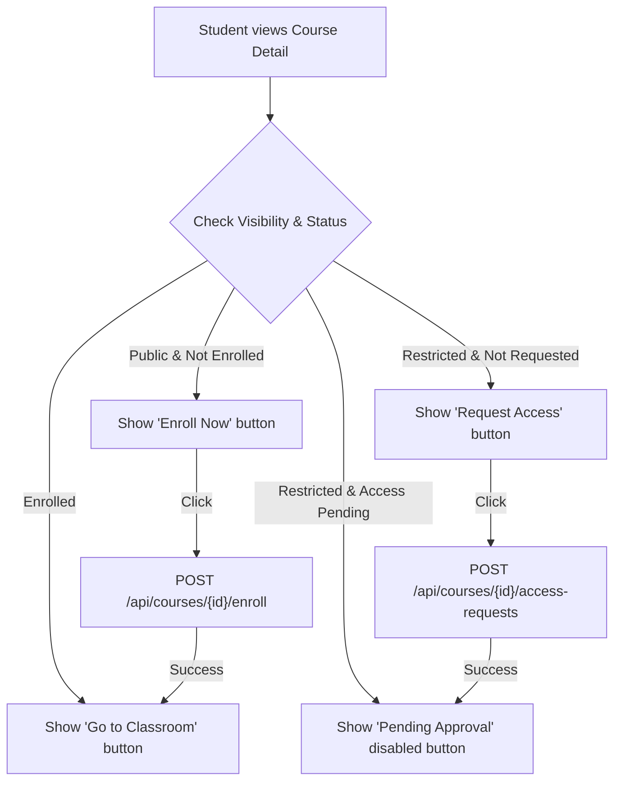
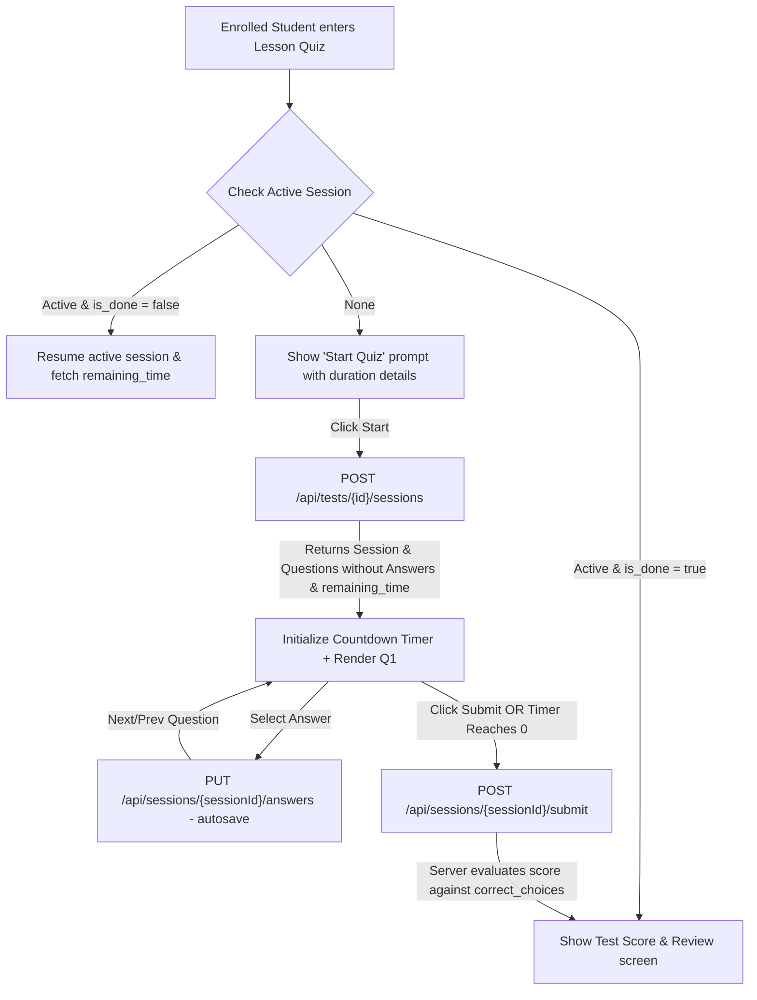
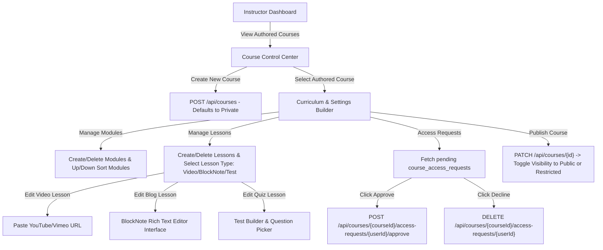
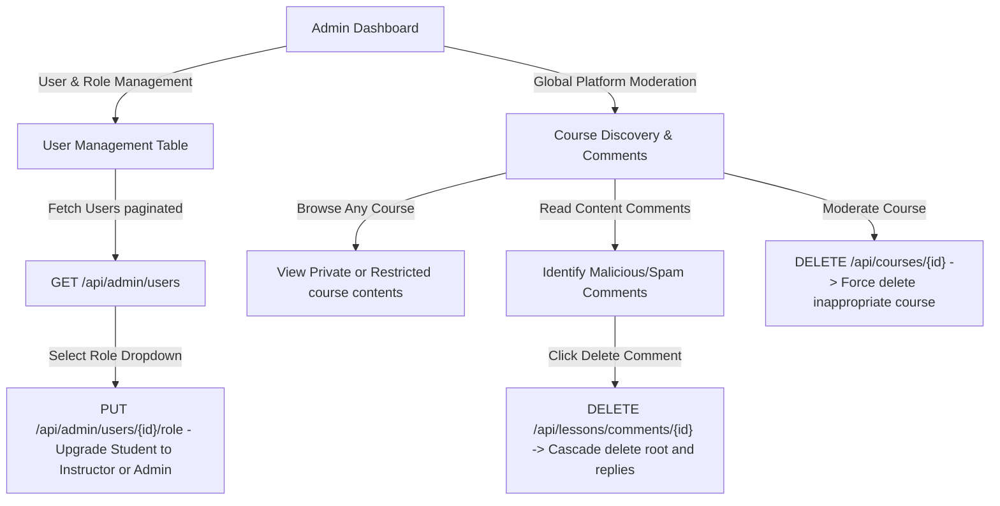

# GocTriThuc — Team Guidelines, User Flows & Day-by-Day Robust Requirements

This document establishes the universal guidelines, core user flows, and day-by-day technical requirements for the **GocTriThuc** team (5 developers: Trung, Anh, Vinh, Sâm, Tuấn). Since all developers are working independently, these rules and detailed steps ensure full alignment, zero integration conflicts, and a high-quality product.

---

## 📖 Table of Contents
1. [Completed Foundation (Days 1–2 Summary)](#-completed-foundation-days-12-summary)
2. [Resolved Architecture Decisions](#-resolved-architecture-decisions)
3. [Deployment & Local Integration Model](#-deployment--local-integration-model)
4. [Core Team Coordination Guidelines](#-core-team-coordination-guidelines)
5. [Universal User Flows (UX Blueprint)](#-universal-user-flows-ux-blueprint)
6. [Stated & Addressed Assumptions](#-stated--addressed-assumptions)
7. [Robust Guidelines for Development & Testing](#-robust-guidelines-for-development--testing)
8. [Day-by-Day Robust Requirements (Days 3–10 Remaining)](#-day-by-day-robust-requirements-days-310-remaining)

---

## 🏆 Completed Foundation (Days 1–2 Summary)

The core project skeleton, database user tables, and authentication engine are **FULLY IMPLEMENTED** and active. Developers should not modify these files unless fixing bugs.

### 1. Database & Migrations Completed
- **Snowflake Generator**: `generate_snowflake_id()` function mapped to `global_id_sequence`.
- **Users Table**: `users` and `user_providers` tables configured in `V202604161951_1__snowflake_id_and_users_table.sql`.
- **Roles Infrastructure**: `roles` table (with bits: `admin`, `teacher` (instructor), `student`) and `user_role` mapping table seeded in `V202604251226_1__user_role_and_permissions.sql`.

### 2. Backend Security & Auth Services Completed
- **Security Config**: `SecurityConfig.java` manages OAuth2 Google + GitHub logins. Enables session-based cookies and native Spring Security `spa` CSRF tokens. Exposes `/api/logout` endpoints.
- **Custom OAuth Service**: `CustomOAuth2UserService.java` integrates Google and GitHub user persistence into the database.
- **Identity Provider APIs**: `UserController.java` exposes `GET /api/users/me` returning details of the currently authenticated session user.

### 3. Frontend Architecture & Login Completed
- **Axios Credentials Configuration**: Mapped in `App.tsx` enabling automatic transmission of cookies.
- **Vite Dev Server Proxy**: Proxies `/api` requests to port `8080` (resolves CORS and CSRF cookie distribution).
- **Core Layouts**: `MainLayout.tsx` handles dynamic headers with user avatar dropdown options.
- **Routing & Authentication Contexts**: Mapped `App.tsx`, `AuthContext.ts`, and `AuthProvider.tsx`. Fetches details on mount.
- **Login Screens**: `LoginPage` renders premium Google and GitHub sign-in redirects.
- **Route Guards**: `GuestRoute.tsx` protects access pathways.

---

## 🏛️ Resolved Architecture Decisions

These engineering choices represent the finalized technical standards for the platform:

| Feature Area | Decision | Technical Resolution |
| :--- | :--- | :--- |
| **Authentication** | Google/GitHub OAuth | **Completed.** Handled natively via Spring Security + session cookies. |
| **Session Storage** | In-Memory Session | **Completed.** In-memory session store (no Redis). Simplest for single-instance Docker. |
| **File Management** | Local Server Storage | **Drop Cloudinary.** All file uploads go via `multipart/form-data` to backend, saved to disk in a persistent **Docker Volume** (zero cost, self-hosted, offline-friendly). Expose download/serve APIs. Configurable directory path to prevent permission issues. |
| **Blog Lesson Editor** | BlockNote Editor | Default editor is **BlockNote** (`feat/blocknote-impl` branch). Frontend inputs/renders rich text, backend receives and sanitizes raw HTML strings. |
| **HTML Sanitization** | Backend Jsoup | Backend sanitizes all incoming HTML strings (from BlockNote/Comments) using the `jsoup` library with a custom extended `Safelist` (allowing BlockNote styles, classes, and data attributes) before saving to prevent XSS. |
| **State Management** | Context + Local State | React Context for global auth state (`useAuth`). Local component state or URL parameters for all features (courses, curricula, tests). No complex RTK/Zustand libraries. Minimal merge conflicts. |
| **Nesting Comments** | Infinite reddit-style | Infinite nesting depth. If comments get too deep (e.g. >5 levels), render a link to redirect the user to a dedicated page for that specific sub-thread. |
| **Restricted Requests** | Separate Request Table | Create a separate `course_access_requests` table (avoids enum column complexity). Approval inserts to `enrollments` and deletes request. Rejection simply deletes request. |
| **Curriculum Order** | Strict Simple UI | Avoid drag-and-drop. Stick to **Up/Down sorting buttons** or manual numeric fields. Fast to code, robust, mobile-friendly. |
| **Test Sessions** | Server-Calculated Timer | Session stores `started_at`. Backend returns `remaining_time` in seconds. Prevent cheating or refresh reset. |
| **Question & Lesson Deletion** | Hard-Delete | Enforce a clean hard-delete with DB-level `ON DELETE CASCADE`. Past quiz scores are dynamically recalculated on-the-fly when requested (deleted questions no longer contribute to total points). |
| **Mocking Strategy** | Mock Service Worker | Stick with MSW for dev simulation. |
| **Testing Standards** | Pragmatic Integration | Require at least **1 integration test** (happy path) per endpoint and **1 security check test** (unauthorized/forbidden path) instead of strict code coverage metrics. |

---

## 🚀 Deployment & Local Integration Model

To keep configuration overhead at zero, the dev and production environments are structured as follows:

```
[Development Integration]
React App (Port 5173) -- Vite Proxy (/api) --> Spring Boot App (Port 8080)
- Identical domain/origin for browsers.
- Perfect CSRF/Session cookie exchange without complex CORS configuration.

[Production Integration]
Spring Boot App (Port 8080)
 ├── /api/** (Endpoints)
 └── /static/** (React build folder "dist/" compiled into backend static resources)
- Serves both frontend UI and backend services under a single domain.
- Self-contained, highly portable, and extremely easy to scale via Docker.
```

---

## 🤝 Core Team Coordination Guidelines

To prevent integration bottlenecks, the team must strictly follow these processes:

### 1. The Async Standup (Daily at 9:00 AM)
Every developer must post a message in the communication channel with:
- **Yesterday**: What tickets were completed.
- **Today**: What tickets are being worked on.
- **Blockers**: Any technical or contract blocker (e.g. "Waiting for BE Lead on Auth contract").

### 2. Git & Branching Strategy
- **Base Branch**: `main` is always production-ready and stable.
- **Branch Naming**: `feature/<issue-number>-<short-description>` (e.g., `feature/24-course-crud-api`).
- **Commits**: Use the **Conventional Commits** standard (e.g., `feat(auth): implement session logout`, `fix(db): correct lessons table primary key`).
- **PR Lifecycle**:
  1. Open draft PR when code is 50% done to allow early visibility.
  2. Mark as ready for review when complete.
  3. PR must receive at least **1 senior approval** (Vinh for FE, Trung for BE, Tuấn Anh for PM/cross-cutting) before merging.

### 3. API Contract-First Development (The Gold Standard)
No backend developer begins writing code, and no frontend developer begins building a UI, until the **API Contract** is finalized and documented.
- **Contract Format**: In the relevant GitHub Issue, write:
  - **Endpoint**: `METHOD /api/path`
    - Use the current unversioned routing scheme already used by the codebase (e.g., `/api/users/me`, `/api/auth/is_authenticated`).
  - **Request Headers**: (e.g., CSRF, Content-Type)
  - **Request Body JSON**: (with field types and validation rules)
  - **Success Response JSON**: (HTTP 200/201, exact structure)
  - **Error Responses**: (HTTP 400, 401, 403, 404, 500 structures)
- **Frontend Unblocking**: Once the contract is saved, the FE developers immediately write MSW mock data handlers matching these exact unversioned contracts. They build and style the entire page before the backend service is deployed.

---

## 🔄 Universal User Flows (UX Blueprint)

These blueprints define exactly how users move through GocTriThuc. All UI layouts and state transitions must match these diagrams.

### 1. Authentication & Role Transition Flow


### 2. Course Enrollment Flow (Public vs. Restricted)


### 3. Quiz / Test Taking Session Flow


### 4. Instructor Flow (Curriculum Management & Access Approvals)


### 5. Admin Flow (Role Management, Moderation & Course Control)


---

## 🔍 Stated & Addressed Assumptions

These design parameters eliminate ambiguity during parallel coding sprints:

1. **Configurable File Storage Path**:
   * *Assumption*: Standard hardcoded folder paths (like `/var/uploads/`) can trigger permission-denied crashes on dev environments (especially Windows/macOS local laptops).
   * *Resolution*: Define upload directory using an environment property `UPLOAD_DIR` in `application.yaml` defaulting to a local `./uploads` relative directory inside the project root folder. This folder is created dynamically upon startup and mapped to a persistent volume in production Docker environments.
2. **Cascade Question Deletion Scoring**:
   * *Assumption*: Deleting a question could break historic test scores or crash database relations.
   * *Resolution*: Enforce a hard cascade delete on relation tables `test_question` and `test_session_answers`. When a student reviews a completed quiz session, the deleted question simply disappears from their list. The student's score is computed on-the-fly based on matching correct answers vs. active questions present in the session history.
3. **Private Course Enrollment Rule**:
   * *Assumption*: Toggling a course's visibility back to `Private` might lock out existing student enrollments.
   * *Resolution*: Setting a course's visibility to `Private` hides it from global searches and prevents **new** enrollments. All **previously enrolled** students retain access, and the course curriculum remains interactive for them.
4. **Infinite Nested Comment Deletions**:
   * *Assumption*: Deleting a parent comment in an infinitely nested thread could leave orphaned sub-threads in the database.
   * *Resolution*: Configure the database foreign key on `parent_id` with `ON DELETE CASCADE`. Deleting a parent comment automatically deletes all of its nested children recursively, keeping database comments intact and self-cleaning.
5. **Comment Thread Pagination Strategy**:
   * *Assumption*: Querying infinitely nested comments in a single payload could exhaust database performance.
   * *Resolution*: Root comments are paginated (20 per page). When clicked, replies are loaded up to a depth of **5 levels** in a single database subtree fetch utilizing a **Recursive Common Table Expression (CTE)** in PostgreSQL. Depth greater than 5 renders a Reddit-style "View single thread" link to fetch that sub-branch in an isolated view.

---

## 🎨 Robust Guidelines for Development & Testing

### Frontend Rules (visual-first, premium feel)
- **Glassmorphism / Premium Styling**: Add `backdrop-blur-md bg-background/80 border border-border/50 shadow-lg` to modern cards and modals.
- **State Auditing**: Every data-fetching view **must** handle 4 distinct states:
  1. **Loading**: Use beautiful skeleton layouts matching the content cards (never use a generic loading spinner for full pages).
  2. **Empty**: Show a friendly vector illustration or descriptive Lucide icon with a Call-To-Action (e.g. "Create your first course").
  3. **Error**: Provide a clear warning banner and a "Retry" button.
  4. **Data Present**: Fully styled grid or list layout.
- **Micro-Animations**: Add transition utilities (`transition-all duration-300 hover:-translate-y-1 hover:shadow-xl`) to all interactive grid items and buttons.
- **BlockNote Editor Integrations**: Ensure `blocknote-editor` is correctly initialized in `read-only` modes for viewers and standard editable modes for authors. Apply high-fidelity custom typography styles to standard text headers.

### Backend Rules (security-first, high performance)
- **Strict Authorization Mapping**: Check permissions in the Service layer, never just in the Controller.
- **HTML Sanitization**: For blog contents uploaded via `BlockNote`, pass raw HTML through a strict sanitization library (`jsoup`) before writing to the database to eliminate XSS injections. Ensure the custom `Safelist` is configured with `.preserveRelativeLinks(true)` so that relative media paths (such as `/api/files/serve/{id}`) are not stripped:
  ```java
  String sanitized = Jsoup.clean(rawHtml, customBlockNoteSafelist);
  ```
- **JPA N+1 Audits**: Run with SQL logging active. Avoid nested loops querying lazy-loaded associations. Use `JOIN FETCH` or `@EntityGraph`.
- **Validation Boundaries**: Annotate DTOs with `@NotNull`, `@NotBlank`, `@Size`, `@Pattern`. Return localized, precise field-level messages in `GlobalExceptionHandler`.

---

## 📅 Day-by-Day Robust Requirements (Days 3–10 Remaining)

This is the revised day-by-day blueprint. Focus shifts purely to the remaining features (Curriculum, Quizzes, local uploads, dashboards, and role promotion administration).

---

### 📆 Day 3 — User Profiles & Local Disk File Uploads
**Objective**: Enable customizable user details and establish the base file upload system utilizing persistent server storage.

#### 🔴 BE Lead (Trung): User Details & File Storage API
- **Profile Mutations**: Expose `PATCH /api/users/{id}` allowing modifications to display name and profile username. Verify username uniqueness.
- **Upload Endpoint**: Expose `POST /api/files/upload`. Handle files via `multipart/form-data`. Save the files to disk using the dynamic `UPLOAD_DIR` path. Save local file details to the database: table `files`, `provider = 'local'`, `provider_value` = relative filePath. Return the created file's ID.

#### 🔴 BE Dev (Anh): Database File Retrieval & Validation Rules
- **Serve Asset API**: Expose `GET /api/files/serve/{id}`. Read from disk using the configured directory path and stream the asset back to the client with appropriate MIME headers.
- **DTO Safety Audits**: Add Hibernate validator annotations across all existing controllers and parameters.

#### 🔵 FE Lead (Vinh): Profile Layout & Local Upload Integration
- **Profile Layout Screen**: Build settings dashboard. Wire mutations to the profile PATCH APIs.
- **Asset Upload Handler**: Build file upload client helpers. Trigger standard `multipart/form-data` uploads directly to `POST /api/files/upload`, catching the returned file ID.

#### 🔵 FE Dev 1 (Sâm): Drag-and-Drop Avatar Upload UI
- **Avatar Dropzone Component**: Build `<AvatarUpload>` using drop-zone actions and upload progress tracking. Show live upload previews before updating the profile avatar.

#### 🔵 FE Dev 2 (Tuấn): Dynamic Badges & Permission Directives
- **Badge Components**: Build `<RoleBadge>` (highlighting roles: Student, Instructor, Admin) and `<UserCard>`.
- **Client Permission Directive**: Create `usePermission(long bit)` helper to easily hide or show buttons based on user permissions on the frontend.

---

### 📆 Day 4 — Course Search & Creation
**Objective**: Build a premium course discovery catalog and enable course creation for instructors.

#### 🔴 BE Lead (Trung): Course Search Engine & Authorization Limits
- **Course API**: Build `GET /api/courses` with pagination and search parameters. Implement visibility filters (guests and unauthenticated users see Public + Restricted; only Private courses are hidden).
- **Course Insertion**: Build `POST /api/courses` restricted to roles with `MANAGE_OWN_COURSES` permission.

#### 🔴 BE Dev (Anh): Course Detail Endpoint & Performance Tuning
- **Detail Extraction**: Build `GET /api/courses/{id}`. Prevent unauthorized users from querying `Private` courses.
- **SQL Profiling**: Verify that requesting a single course does not trigger extra queries (prevent N+1 queries using `@EntityGraph` or `JOIN FETCH`).

#### 🔵 FE Lead (Vinh): Modern Course Catalog Layout
- **Course Grid**: Build the Course Search page. Arrange course cards in a clean grid.
- **Premium Card Component**: Build `<CourseCard>` with thumbnail images, title text, instructor details, visibility badges, and micro-hover scaling.

#### 🔵 FE Dev 1 (Sâm): Debounced Filters & Navigation Tabs
- **Search Filters**: Build a debounced search bar input (updating search criteria 300ms after the user stops typing). Add tabs to filter courses by visibility: `All`, `Public`, or `Restricted`.

#### 🔵 FE Dev 2 (Tuấn): Course Creation Dialog
- **Course Creation Dialog**: Build `<CreateCourseModal>` accessible only to users with the `MANAGE_OWN_COURSES` permission. Include fields for title, description, visibility state, and a thumbnail upload dropzone.

---

### 📆 Day 5 — Course Details & Classroom Enrollment
**Objective**: Enable course exploration, classroom access, and restricted course admission requests.

#### 🔴 BE Lead (Trung): Access Request & Course Mutations
- **Update and Delete Endpoints**: Build `PUT/PATCH/DELETE /api/courses/{id}`. Perform validation checks in the service layer: only the course author or an administrator can modify or delete a course.
- **Enrollment Flow**: Build `POST /api/courses/{id}/enroll` (immediately enrolls students in `Public` courses).
- **Access Requests**: Build `POST /api/courses/{id}/access-requests` which inserts a pending access record in the `course_access_requests` table.

#### 🔴 BE Dev (Anh): Classroom Access Status Check
- **Access Check API**: Build `GET /api/courses/{id}/access-status`. Query both `enrollments` and `course_access_requests` to determine relationship: `{ status: "none" | "requested" | "enrolled" }`.

#### 🔵 FE Lead (Vinh): Classroom Header & Action Controls
- **Classroom Header**: Build the Course Details classroom dashboard header.
- **Contextual Enrollment CTA**: Display the appropriate action button based on the user's enrollment status:
  - "Enroll Now" (for public courses).
  - "Request Access" (for restricted courses).
  - "Requested — Pending Approval" (disabled state for pending requests).
  - "Go to Course Content" (for enrolled students).

#### 🔵 FE Dev 1 (Sâm): Module Sidebar & Navigation Accordion
- **Classroom Navigator**: Build an expandable `<ModuleSidebar>` accordion visible only to enrolled students and instructors. Show module sections and lessons with their respective type icons (video, blog, quiz) and completion checkboxes.

#### 🔵 FE Dev 2 (Tuấn): Restricted Access UI & Editing Controls
- **Access Notification Banner**: Build `<RestrictedAccessBanner>` shown to non-enrolled users visiting restricted course dashboards. Include descriptions of the approval rules.
- **Instructor Editing Panel**: Build `<CourseEditModal>` with forms to update title details, visibility settings, and course thumbnails.

---

### 📆 Day 6 — Course Curriculum Editor
**Objective**: Enable instructors to organize course curricula by managing and structuring modules and lessons.

#### 🔴 BE Lead (Trung): Curriculum & Content Endpoints
- **Module Management**: Build Module CRUD endpoints: `POST/PUT/DELETE /api/courses/{id}/modules`. Verify that only the course author can modify modules.
- **Lesson Management**: Build Lesson CRUD endpoints: `POST/PUT/DELETE /api/modules/{id}/lessons`. Keep lesson types strict: `blog`, `video`, or `test`.

#### 🔴 BE Dev (Anh): Up/Down Reordering APIs
- **Reordering Endpoints**: Build sequential sorting endpoints: `PATCH /api/modules/{id}/order` and `PATCH /api/lessons/{id}/order`. Accept up/down movement commands, validate limits, and adjust index rankings for sibling items in the database.

#### 🔵 FE Lead (Vinh): Curriculum Editor Workspace
- **Curriculum Builder Interface**: Build the Instructor Curriculum Editor panel. Group lessons within an accordion view representing each module, and add quick-action buttons: "Add Module" and "Add Lesson".

#### 🔵 FE Dev 1 (Sâm): Up/Down Ordering Actions & Optimistic Updates
- **Reordering Actions**: Build Up/Down arrow buttons beside each module and lesson card. Update the UI index array immediately (optimistic UI rendering) before sending the PATCH request, and revert indices if the network request fails.

#### 🔵 FE Dev 2 (Tuấn): Content Forms (Video & BlockNote editor integration)
- **Video Content Creator**: Build `<VideoLessonForm>` supporting YouTube or Vimeo URLs. Instructors paste a raw link, and the UI saves it as-is in the database.
- **Rich Text Content Creator**: Integrate the `BlockNote` editor (`feat/blocknote-impl` branch) inside `<BlogLessonForm>`. Provide full formatting tools and clean styling variables matching CSS tokens.

---

### 📆 Day 7 — Lesson Player & Completion Tracking
**Objective**: Build a clean lesson viewer, track lesson completions, and support attachments.

#### 🔴 BE Lead (Trung): Lesson Completion & Progress Summary
- **Completion Marker**: Build `POST /api/lessons/{id}/complete` to toggle lesson completion status for the authenticated student.
- **Progress Summary API**: Build `GET /api/courses/{id}/progress` returning progress stats: `{ completedLessons: 4, totalLessons: 10, percent: 40 }`.

#### 🔴 BE Dev (Anh): File Attachment Management
- **Resource Management**: Expose resource attachment endpoints: `POST /api/lessons/{id}/resources` and `POST /api/courses/{id}/resources` to link uploaded files as resources. Expose matching list endpoints to download attachments.

#### 🔵 FE Lead (Vinh): Responsive Lesson Player
- **Lesson Viewer Layout**: Build a responsive double-column viewer: the main workspace displays the active lesson content, and the collapsible side drawer hosts the course outline and progress bar.
- **BlockNote Lesson Reader**: Build `<BlogLessonViewer>` utilizing the `BlockNote` editor's read-only mode to render rich text blocks with high-fidelity formatting. Build `<VideoLessonViewer>` parsing and rendering standard YouTube/Vimeo embed players dynamically.

#### 🔵 FE Dev 1 (Sâm): Linear Navigation Controls
- **Lesson Navigation Panel**: Build "Previous" and "Next" navigation buttons beneath each lesson page. Automatically transition across module boundaries when navigating.

#### 🔵 FE Dev 2 (Tuấn): Progress Actions & Resource Downloads
- **Completion Checkbox Action**: Build a "Mark as Complete" action button that updates progress indicators and checkboxes in the sidebar immediately.
- **Downloadable Resource Shelf**: Build `<LessonResourceList>` displaying resource list items with matching file icons and download links.

---

### 📆 Day 8 — Question Bank & Test Builder
**Objective**: Build reusable multiple-choice questions and enable quiz creation.

#### 🔴 BE Lead (Trung): Question Bank CRUD & Quiz Linkage
- **Question Management**: Build Question Bank CRUD: `GET/POST/PUT/DELETE /api/questions`. Only instructors can access their own question banks.
- **Quiz Setup**: Build Test CRUD. Link tests directly to a course lesson. Build `POST /api/tests/{id}/questions` to add questions to a test with point values and order settings.

#### 🔴 BE Dev (Anh): Safe Question Retrieval for Students
- **Safe Question List**: Build `GET /api/tests/{id}/questions`. If the authenticated user is a student, **hide** the `correct_choices` property in the response payload to prevent cheating. Keep this endpoint secure.

#### 🔵 FE Lead (Vinh): Quiz Builder Workspace
- **Quiz Editor**: Build the Instructor Quiz Builder page. Enable instructors to search and select questions from their question banks and add them to a test, with customizable point distributions.

#### 🔵 FE Dev 1 (Sâm): Question Form Editor
- **Question Form**: Build `<QuestionForm>` supporting question text, dynamic options, correct choice selection toggles, and single/multi-choice settings.

#### 🔵 FE Dev 2 (Tuấn): Quiz Setting Panels & Bank Search
- **Quiz Metadata Panel**: Build `<TestSettingsForm>` containing quiz duration controls and custom instruction descriptions.
- **Question Bank Search**: Build the Question Bank view with search and filter inputs for instructors.

---

### 📆 Day 9 — Timed Quiz Session & Scoring Engine
**Objective**: Build a timed test-taking experience with automated server-side scoring and cheat-proof states.

#### 🔴 BE Lead (Trung): Test Sessions & Automated Scoring
- **Test Session Controller**: Build session controllers:
  - `POST /api/tests/{id}/sessions` (starts a new timed session; only allows one active session at a time per user). Save initial `started_at` in the database.
  - `POST /api/sessions/{id}/submit` (submits the test, sets `is_done = true`, compares answers to correct keys in the database, and calculates the score).
  - `GET /api/sessions/{id}/result` (returns the user's score and answer review).
- **Cascade Deletion Handling**: Ensure deleting a question deletes its associations from `test_question` and `test_session_answers` (hard cascade delete). Historic quiz scores are dynamically recalculated based on remaining questions when queried.

#### 🔴 BE Dev (Anh): Real-Time Answer Autosave & Server Timer Calculations
- **Real-Time Answer API**: Build `PUT /api/sessions/{id}/answers` to save student answers immediately upon selection. Return a warning if the student tries to submit answers after the session time limit has expired.
- **Server Timer calculation**: When fetching active test sessions, calculate remaining time on the backend: `remaining_time = started_at + time_limit - current_time`. Prevent client-side timer manipulation.

#### 🔵 FE Lead (Vinh): Timed Test Interface & Active Session Restorations
- **Test Taking Interface**: Build the Test Viewer layout. Display an active countdown timer at the top initialized by the backend's `remaining_time` field, a list of question numbers in a sidebar, and the active question card. Automatically submit the test when the countdown timer reaches zero.

#### 🔵 FE Dev 1 (Sâm): Multiple-Choice Option Cards
- **Option Picker Component**: Build `<MultipleChoiceQuestion>` displaying question statement options. Support radio button styling for single-choice questions and checkmarks for multi-choice questions. Autosave the user's answers as they are selected.

#### 🔵 FE Dev 2 (Tuấn): Quiz Results & Score Reviews
- **Quiz Review Dashboard**: Build `<TestResultScreen>` displaying the final score, total duration, and a question-by-question breakdown showing correct and incorrect answers. Prevent users from re-taking completed test sessions.

---

### 📆 Day 10 — Reddit-Style Threaded Comments, Instructor Dashboards, Admin Control & Review
**Objective**: Build infinitely nested discussion threads, instructor/admin control centers, and perform end-to-end QA.

#### 🔴 BE Lead (Trung): Threaded Comments & Restricted Access Approvals
- **Reddit-Style Comments**: Build Comment CRUD endpoints for `lesson_comments` and `announcement_comments`. Support infinite nesting using a nullable `parent_id` column.
- **Access Request Management**: Build access request endpoints:
  - `POST /api/courses/{courseId}/access-requests/{userId}/approve` (finds pending `course_access_requests` entry, deletes it, and inserts a matching record in `enrollments`).
  - `DELETE /api/courses/{courseId}/access-requests/{userId}` (denies request by deleting it from `course_access_requests`).

#### 🔴 BE Dev (Anh): Admin APIs, SQL Profiling & Code Formatting
- **Admin User Management APIs**: Expose `GET /api/admin/users` (paginated list of all accounts) and `PUT /api/admin/users/{id}/role` (allows role changes). Ensure `@PreAuthorize` restricts this strictly to users with Admin permissions.
- **Performance Profiling**: Audit all JPA queries using `spring.jpa.show-sql=true`. Resolve N+1 queries. Run code formatting checks.

#### 🔵 FE Lead (Vinh): Infinite Reddit-Style Comments Drawer
- **Threaded Comment Component**: Build a highly polished, nested `<CommentThread>` component with recursive UI rendering for threaded comments.
- **Reddit-Style Thread Redirection**: If nesting depth exceeds **5 levels**, display a "View single thread" button/link that opens a dedicated view focusing solely on that comment subtree as the root.

#### 🔵 FE Dev 1 (Sâm): Announcement Boards
- **Announcements Page**: Build the Course Announcements page. Instructors can post announcements, and enrolled students can view them and participate in discussion threads.

#### 🔵 FE Dev 2 (Tuấn): Dashboards, Admin UI & Quality Checks
- **Student Dashboard**: Build the Student Dashboard showing a list of enrolled courses with progress bars and a "Continue Learning" button linking to the last incomplete lesson.
- **Instructor Dashboard**: Build the Instructor Dashboard listing authored courses, question bank management shortcuts, and a table to approve or deny restricted course access requests.
- **Admin Dashboard Table**: Build a user list view displaying user credentials and a dropdown to promote/demote user roles. Wire triggers to `PUT /api/admin/users/{id}/role`. Run final quality linter checks.
- **End-to-End QA Run**: Run a full end-to-end smoke test of all user flows.

---

## 📈 Summary of Work Distribution

| Member | Primary Focus | Key Deliverables |
| :--- | :--- | :--- |
| **Trung (BE Lead)** | Platform Security & Core Services | Curriculum CRUD, local disk multipart upload engines, quiz controllers, infinite nested comments. |
| **Anh (BE Dev/PM)** | Infrastructure & Performance QA | Permission service, local asset file streaming, DTO audits, question retrievals, reordering handlers, SQL profiling, Admin User APIs. |
| **Vinh (FE Lead)** | Architecture & Layout | BlockNote renderer layouts, timed quiz engines, Reddit-style comments. |
| **Sâm (FE Dev 1)** | Components & User Actions | Shared DTO structures, local form uploads, course cards, up/down actions, multi-choice pickers. |
| **Tuấn (FE Dev 2)** | Indicators & Controls | Skeleton screens, lesson video forms, quiz score reviews, Admin role managers. |

---

> **Note to Developers**: Treat this document as the single source of truth for features and requirements. Refer to it during development to ensure consistency. Do not make architectural or schema deviations without getting approval from the Tech Lead.
